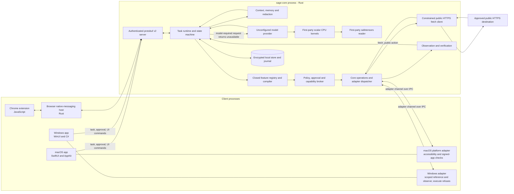
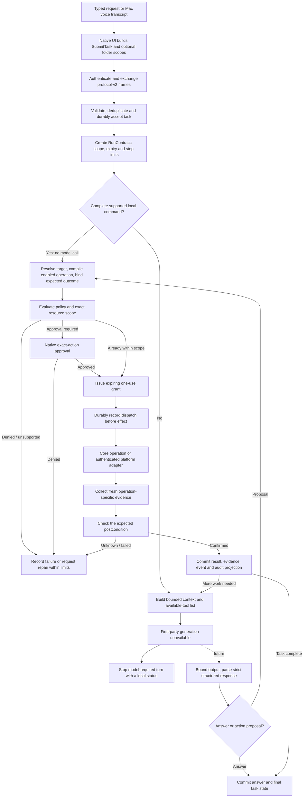

# Sage system architecture and model flow

**Source snapshot:** 8 October 2026, branch `codex/sage-runtime-rebuild`.
**Scope:** this guide describes the source in the current working tree. The checkout already contains pre-existing edits; this document does not claim that those edits are committed or that every path has passed live device acceptance.

**Evidence key:** “Current source” describes code, build configuration and protocol contracts present in this checkout. “Unqualified” means source inspection alone does not prove live provider, operating-system, browser, microphone, packaging or distribution behavior. The architecture below is traced from implementation and build/protocol files.

## 1. The short version

Sage is a native Mac and Windows desktop agent with a shared Rust core. The desktop apps collect requests, show task state and approvals, and provide platform-specific interactions. The Rust core owns task state, context assembly, the enabled-tool registry, policy checks, capabilities, file/network execution, persistence, observation, verification and recovery. The first-party inference path is under construction: scalar reference math and measured AArch64 NEON Q4, attention, and recurrent-state kernels, a bounded safetensors reader, a Qwen3.5-4B architecture profile and a Sage-written text tokenizer/chat formatter exist, but Sage currently selects no generator. Hosted model APIs and external model executables are disabled in product startup.

When implemented, the first-party model will remain an untrusted planner whose output is never execution authority. Sage Core resolves the target, checks the installed operation and policy, obtains any required approval, grants narrowly scoped one-use authority, executes the operation, and checks fresh evidence before reporting success. Open-ended model tasks are unavailable until the local generation path is implemented and qualified.

A bounded Rust intent compiler now recognizes basic app, file and folder commands without a model. Native clients preview those commands while the user types or speaks. Accepted local graphs pass through the same policy, authority and verification boundaries. With explicit opt-in, Sage can also identify an exact repeated low-risk procedure after three independently requested, fully verified runs. The user reviews its observed wording and steps before reuse. A learned graph contains no saved authority: every run resolves current resources, obtains fresh scope or approval and passes through the ordinary broker and verifier. Local corrections can retain completed and running unchanged steps, replace reads, and rewire unstarted successors; they cannot silently discard an already dispatched mutation. The [continuous agency ledger](v3/continuous-agency.md) records the larger requested scope and its outstanding acceptance work.

```text
User request → native client → authenticated protocol v2 → Rust Sage Core
    → local intent compiler, or bounded context → first-party inference (under construction)
    → typed action proposal
    → prepare / policy / approval → one-use capability → execution
    → fresh observation → verification → durable result → next model turn or answer
```

## 2. System architecture



The diagram shows logical ownership and process boundaries, not separate microservices. Current Core startup selects an unconfigured provider; the CPU kernels and weight reader are not connected to generation. Protocol-v2 provider fields remain only for wire compatibility: save requests are rejected, connection tests return disabled, and state snapshots return no provider settings. Core no longer loads provider profiles. The model setup UI exposes no endpoint or credential fields. Some operations also depend on a connected adapter and the current platform. The Mac and Windows apps run their adapters inside the client process; they are not separate signed native-execution services. The browser extension and native host have a browser-specific authenticated session.

### Main boundaries

| Component | Language / location | Owns |
|---|---|---|
| Shared authority core | Rust, `crates/sage-core` | Run and action state, context, tool availability, policy, capabilities, model calls, resource resolution, execution, verification, storage, audit and schedules |
| Inference worker boundary | Independent Rust crate `crates/sage-inference-worker` depends only on `serde` and `serde_json`; it is packaged on macOS as a separately signed `SageInferenceWorker.app` with only the App Sandbox entitlement. Core resolves the helper beside its own executable, launches it with a cleared environment and bounded pipes, checks a random challenge, child PID, protocol version and closed readiness state within two seconds, then owns the child for its lifetime | Startup launch and handshake ownership are implemented. Health monitoring/restart, signed package transfer, model loading and generation, Windows confinement, and installed-app denial/FD-transfer acceptance remain open; this does not pass `process_isolation` |
| Effect ownership | Rust, `crates/sage-core/src/effect_ownership.rs` | Four bounded dispatch slots; shared/exclusive ownership by exact prepared file, application, browser tab and network origin; directory listing versus child creation fencing; global exclusive compensation fence |
| Wire protocol | Protocol Buffers, `proto/sage/ipc/v2/sage.proto` | Versioned commands, events, grants, adapter requests and typed browser/application target fields |
| Protocol bindings | Rust via `prost`; Swift via SwiftProtobuf; C# generated during Windows build | Language-specific protocol types generated from the same v2 schema |
| macOS app | Swift 6.1 package, SwiftUI and AppKit, `apps/macos` | UI, folder selection, core supervision/client, Mac platform adapter, voice input/output and task presentation |
| Windows app | C# / .NET 8, WinUI and XAML, `apps/windows` | UI, core supervision/client, folder selection, Windows platform adapter and task presentation |
| Browser extension | JavaScript, `integrations/browser` | User-gesture pairing, explicit bounded page references, passive foreground control discovery, document identity checks and the currently registered navigation operation |
| Browser native host | Rust, `crates/sage-browser-worker` | Role-authenticated relay between Chrome native messaging and Sage Core |
| Sage first-party inference (opt-in `qwen35-evaluation`) | Rust, `inference_cpu.rs`, `crates/sage-kernels`, `inference_resources.rs`, `inference_lane.rs`, `planner_schema.rs`, `crates/sage-model-package`, `crates/sage-qwen-tokenizer`, `qwen35.rs`, `qwen35_loader.rs`, `qwen35_vision.rs`, `structured_decode.rs`, `crates/sage-metal` | Scalar reference math and measured AArch64 NEON grouped-Q4 projection and attention kernels, including Qwen text MRoPE with per-layer precomputed frequency denominators and a reusable per-token sine/cosine table applied across query/key heads; three M3 release runs measured about 64% lower p50 and p95 in the isolated 20-head fixture ([measurement](../evals/evidence/2026-10-08-qwen-mrope-angle-reuse/measurement.md)); full-head axial vision RoPE; a bounded zeroizing binary16 KV cache with first-party NEON widening, plus per-layer preallocated attention workspaces with fixed 2,048-position f64 score blocks and online stable softmax; reusable zeroizing full-attention projection, Q/K normalization, and gate buffers remove per-head/per-token vector allocation and are included in memory admission; a first-party AArch64 NEON zero-centered RMS path keeps f64 accumulation and measured 30.6% lower p50 and 57.4% lower p95 across three runs in a 20-head normalization microbenchmark ([measurement](../evals/evidence/2026-10-08-qwen-rms-reuse/measurement.md)); a first-party NEON sum-of-squares reduction for linear-attention gated RMS measured 10% lower p50 and 8% lower p95 against allocating scalar normalization across three 1,001-sample runs ([measurement](../evals/evidence/2026-10-08-qwen-gated-rms-reuse/measurement.md)); reusable layer normalization scratch, caller-owned residual destinations, and two-buffer token ping-pong remove per-layer normalization, residual-copy, and layer-return allocations; linear-attention projections, convolution, query/key expansion, recurrent output and gated normalization now use retained zeroizing scratch to remove intermediate per-token allocations (3,551,232 bytes across 24 layers, included in admission); cooperative resource admission, pinned package verification, signed-package-bound text and vision candidate loading, bounded RGB patch extraction, patch embedding and learned-position interpolation, the ordered 24-block vision stack, merger and text-width image encoding; mixed image/text prefill with spatial positions; a 256 KiB bounded planner-schema prefix automaton for closed tool enums, required fields, string/integer bounds and read-batch rules, followed by independent turn validation; one-token linear/full-attention layers and 2K-bounded text generation with cumulative root-answer previews through a bounded nonblocking channel; an optional first-party Metal grouped-Q4 projection path with paired-nibble loads and reusable, zeroized per-matrix I/O buffers; on a Qwen-sized 2,560×2,560 fixture, three M3 runs measured 2.553/3.013 ms p50/p95 for retained Metal buffers with caller-owned output versus 2.574/2.989 ms with fresh buffers, while CPU NEON measured 0.212/0.246 ms; the measured Metal route remains evaluation-only and slower for this workload, and its 10,752,000-byte workspace reserve is included in model admission ([measurement](../evals/evidence/2026-10-08-metal-q4-workspace/measurement.md)); an evaluation-only `ModelProvider` adapter over one persistent in-process generation thread; no admitted real checkpoint or product-bound provider, GPU coverage beyond Q4 projection or isolated persistent worker |
| First-party CPU reference and SIMD kernels (evaluation feature) | Rust, `crates/sage-core/src/inference_cpu.rs`, `crates/sage-kernels` | Bounded scalar tensor shapes, dense projection, ordinary/zero-centered/gated RMS normalization, SiLU, softmax, generic interleaved, Qwen text MRoPE and axial vision RoPE, grouped-query attention, lazy zeroizing KV and gated-delta state, causal depthwise convolution history, Qwen gate conversion, batch and streaming Q4 packing/projection, and f16/bf16 conversion; the 8K cache ceiling remains unchanged while construction starts with zero KV allocation and prompt prefill reserves only its validated prefix; on synthetic fixtures, AArch64 NEON Q4 projection is 7.5× faster at p50 than f64 reference, Q·K scoring is 6.4×, weighted values 4.9×, and a 32-head gated-delta recurrence is about 5×; other CPU operators, checkpoint parity and generation performance remain unqualified |
| First-party weight container reader (evaluation feature) | Rust, `crates/sage-model-package/src/safetensors.rs` | Parses bounded safetensors headers from an already-open handle, rejects duplicate names, overlapping/gapped byte ranges and unsupported dtypes, and streams finite f16/bf16/f32 tensor ranges; signature/package admission and model graph loading remain separate |
| First-party model-package verifier and signer | Rust, `crates/sage-model-package` | Verifies a closed v2 manifest for the pinned Qwen3.5-4B revision with Ed25519 keys supplied from the application trust set, hashes exactly the config, tokenizer, preprocessor, index and two weight shards in bounded chunks, and can retain the same open reader with its receipt; the standalone offline signer checks source size and digest pins and reads its seed from stdin without persisting it; no production trust key or evaluation-approved package is configured |
| Qwen3.5 target profile and candidate loader (evaluation feature) | Rust, `crates/sage-core/src/qwen35.rs`, `crates/sage-core/src/qwen35_loader.rs`, `crates/sage-core/src/qwen35_vision.rs` | Checks the pinned 4B hybrid text/vision geometry and exact 738-name/two-shard index, then binds signed config/tokenizer/image-preprocessor/index metadata and both signed open shards into a 32-layer Q4 text plus 24-block Q4 vision evaluation candidate, with f32 patch/position tensors, bounded RGB encoding, image-pad replacement, spatial MRoPE positions and closed-schema generation, cooperative memory admission covering both models, and post-load shard rehash; no real checkpoint load, image parity, task-quality evidence or persistent product worker is qualified |
| Qwen text tokenizer (evaluation feature) | Rust, `crates/sage-qwen-tokenizer` | Standalone first-party crate parses the pinned vocabulary and merges, runs Sage-owned Unicode 15 normalization and ByteLevel BPE, and formats text chat with literal message bodies plus trusted multimodal image framing and spans; eight strings from the exact pinned tokenizer matched Sage's deliberately slow BPE merge reference, while broader official-vector coverage, inference-worker use and admitted-model integration remain open ([preflight evidence](../evals/evidence/2026-10-08-qwen-candidate-preflight/measurement.md)) |
| Persistence | SQLite with SQLCipher, accessed by Rust | Tasks, actions, events, conversations, memory lineage, workflow definitions, receipts, audit links and recovery records |

The opt-in Qwen vision path batches up to 256 patches per projection wave. Its Q4 patch embedding uses bounded 32-patch tiles, reuses decoded weights, and dispatches to at most eight first-party AArch64 workers; vision-block QKV, attention-output, and MLP projections also use bounded batches. Layer normalization writes into reusable scratch, and the attention path uses first-party f64-accumulating NEON dot and weighted-value kernels with reusable score, weight, and context buffers. Learned patch positions are added in place. Separate synthetic release microbenchmarks on an 8 GiB Mac15,3 measured a 3.83× median p50 gain for patch projection and a 2.53× gain for 128-token, 16-head attention arithmetic. These kernel-only results do not establish real-checkpoint parity, full vision-block latency, image quality, or end-to-end encoder performance ([patch projection](../evals/evidence/2026-10-08-q4-batched-vision-projection/measurement.md), [attention](../evals/evidence/2026-10-08-q4-batched-vision-projection/vision-attention-measurement.md)).

The Rust workspace uses edition 2024 and declares Rust 1.89 as its minimum. Rust is the core and broker language; it is not itself the language or weights of the reasoning model.

## 3. End-to-end model and task flow



There is no provider failover or hosted model route in current product startup. Supported deterministic local commands may still run through the Rust intent compiler.

### Local intent, corrections and overlapping execution

`intent.rs` implements an all-or-nothing grammar bounded to 4 KiB and eight steps. `and` expresses independent clauses; `then` introduces a barrier. Absolute quoted file paths, selected-folder listings and known application aliases compile to typed actions. Unsupported text requires model planning and is reported unavailable until Sage's first-party generator is connected. Partial transcripts produce preparation previews only; early execution before speech finishes remains unimplemented.

The authenticated dispatcher has separate bounded regular, control and preparation lanes. Utterance-leading Stop/Hold/Correction phrases signal the run synchronously before persistence. Monotonic transcript revisions prevent an older recognition result from interrupting a newer one. Grants wait during Hold and recheck retirement, cancellation and expiry before consumption.

`reconciliation.rs` commits a local correction, its command receipt, closed decisions, task/message update and audit record atomically. Unchanged action identities and matching dependency edges survive. An unstarted successor keeps its identity while its predecessor edges change. Changed reads are retired and their owned futures are dropped; retired results remain in history but do not count as current completion or enter a captured skill. The run keeps its original scope, expiry and cumulative 32-step budget. A correction of an already dispatched mutation stays paused for effect review instead of treating cancellation as Undo. Scope changes and unsupported grammar still use whole-run supersession. General compensation and continuous mutation replacement remain open.

`scheduling.rs` polls up to four owned local read futures within one task. A completed predecessor can admit its ready successor while unrelated reads continue. Mutation and approval admission remain serial within that task. Across active tasks, `effect_ownership.rs` permits compatible prepared effects to overlap under four shared dispatch slots: same-file reads share a lock, writes exclude same-file reads/writes, separate file targets may overlap, and a directory listing excludes child creation. Undo takes the global exclusive fence after active effects settle. Target ownership is acquired only after exact approval and held through fresh verification; it does not grant authority. Operation-level moving averages prioritize estimated critical paths; these measurements are not calibrated cross-device or execution-route predictions. File preparation/read/verification uses a four-worker blocking lane with a three-second owner deadline. A stuck kernel call retains its worker permit until it returns. One accepted credential unlock owns both the blocking job and cache hydration, even after its requesting client disappears.

`learning.rs` records bounded samples only from successful, fully verified, non-background, independently requested runs in an explicit low-risk action allowlist. Corrected, failed, undone or retired evidence cannot strengthen a pattern. Samples store a normalized request key and canonical typed action DAG, never provider weights, screenshots or old grants. Three distinct task identities are required. The routine card shows observed requests and steps; enabling requires an explicit review digest, and the user can forget both samples and review. Matching is exact after a small wording normalization (`please` and whitespace/case outside quoted values); this is not general language understanding. A reused graph receives new action IDs and a new run contract. The core rechecks its reviewed binding before preparation and dispatch, and ordinary resource policy still prompts when a fresh run has no matching folder scope. The routine path does not call a model in the tested case, but it does not predict branches, compose learned routines, or expand the supported action vocabulary.

### What happens at each stage

1. **Input and scope.** The native UI submits the request and, when selected, folder roots with `read` or `create` effects. Model output cannot create or widen these roots. New interactive runs start with no folder roots if none were selected. Core-side scope validation limits submissions to 32 roots and accepts only read/create folder scope.
2. **Authenticated transport.** The client and core negotiate the same protocol version and authenticate a local session. Frames carry monotonically increasing sequence numbers; replayed frames and repeated non-submission request IDs are rejected. A submitted command is idempotently associated with its request identity before the client is told that the task was accepted.
3. **Run contract.** The core creates a broker-owned `RunContract`. The default contract expires after two hours, has at most 32 action steps and two planning-repair attempts, and binds scopes to that run. Background schedules carry their own explicit expiry, run budget and folder scopes.
4. **Context assembly.** The core combines the current request, enabled tool descriptors, recent conversation context, applicable memories/preferences and bounded authorized-root metadata. Up to eight recent verified tool results are added to the model turn separately. The context builder accepts explicit observations, but the ordinary `run_task` path currently passes an empty observation list; it does not automatically collect foreground-app state. Context data is bounded and redacted. Memories, history, files, browser content and tool output are untrusted reference material, not permissions or instructions.
5. **Provider admission.** Core currently selects `UnconfiguredModelProvider`. Old provider settings can remain in encrypted storage, but Core no longer reads or returns them. Protocol-v2 save/test commands are retained only for compatibility: saves are rejected, tests return disabled, and snapshots keep the deprecated settings list empty. The client UI has no endpoint or API-key fields, and managed external-runtime CLI flags are rejected.
6. **First-party inference foundation.** Sage has an opt-in `qwen35-evaluation` stack with scalar CPU reference operations, a lazily allocated zeroizing binary16 KV cache stored in contiguous per-head banks and widened for f32 attention arithmetic, gated-delta state, causal QKV convolution history, one-token Qwen3.5 linear/full-attention sublayers with f32 or grouped-Q4 projections, a bounded f16/bf16/f32 safetensors reader, an incremental Q4 builder, a signed-package-bound 32-layer text and 24-block vision candidate loader, text/vision preprocessing and mixed prompt support, a Sage-written text decoder with tied output embeddings and selected AArch64 NEON kernels, a Sage-written tokenizer, and an optional runtime-compiled Metal Q4 matrix-vector kernel. At the 8K limit the eight full-attention layers require 256 MiB of binary16 KV storage, versus 512 MiB with the prior f32 representation; the cache reserves the validated prefill prefix and grows geometrically. A synthetic Qwen geometry benchmark measured a 74% reduction in 8K QK/value-kernel p50 with per-head contiguous storage and exact score/output parity; it does not establish full-model latency or task quality. Planner generation intersects its JSON grammar with a schema-derived prefix automaton for canonical closed-object keys, enabled tool enums, required payloads, bounded strings/integers, answer/action shape, and read-only batches; completed turns still pass the independent validator. `CandidateModelProvider` can route evaluation turns through a persistent in-process inference lane. Core now owns a separately sandboxed macOS worker after a bounded startup handshake, but the helper reports `model_not_admitted` and is not connected to package loading or generation; product startup still uses `UnconfiguredModelProvider`. No real checkpoint has been imported or admitted: broader tokenizer reference-vector coverage, checkpoint parity, task-quality/quantization qualification, Metal coverage beyond Q4 projection, and installed process isolation remain open. There is no silent remote fallback.
7. **Proposal validation.** The model boundary accepts a non-empty answer or a typed action graph when a first-party generator is connected. The current incremental turn schema permits one proposed action or up to eight independent `read_file`, `list_directory`, or `fetch_public` actions. The core parses the closed action types, validates inputs and graph dependencies, creates action IDs and model provenance, and rejects unknown/malformed output. No production generator is connected today.
8. **Prepare and compile.** The core resolves the target from broker-controlled resource data, confirms the action exists in the enabled feature registry, selects an installed implementation and binds a trusted expected outcome. Browser operations bind to a paired tab/document. Mac app launch binds to a validated signed application identity. File operations pin and recheck filesystem identities.
9. **Policy and approval.** Deterministic risk classification and Sage's first-party dispatch gate run independently of the model. A task folder scope can cover reads and non-overwriting creation under that root. Overwrite, external effects, expanded resources and consequential actions need the applicable exact approval; prohibited or unavailable operations fail closed. Approval is bound to a digest of the broker-resolved proposal and its displayed resource/preview.
10. **Capability and dispatch.** After approval, the capability broker issues a short-lived, single-use grant bound to the run, action digest, operation, resource, policy version and, when applicable, worker session. A durable dispatch record is committed before Sage asks an executor to perform the effect.
11. **Execution and verification.** The execution broker calls the narrow Rust operation or sends a typed adapter request. A separate observer collects fresh evidence; the verifier compares that evidence with the broker-installed expected outcome. A worker's `success` field by itself is not sufficient proof.
12. **Result and next turn.** Confirmed results and private artifacts are committed with task/action state, journal, event and audit link. The next model call receives the real bounded result. If there is no more work, deterministic finalization writes the answer and final task status from stored evidence rather than trusting model claims about completed actions.

## 4. What the model does and does not do

### Model input

`context::build_context` constructs the planning context. It includes the current request, run metadata, enabled tool descriptors, trusted constraints and bounded untrusted context records. Recent verified tool results are added separately to the turn. Although the builder accepts explicit observations, the ordinary `run_task` call supplies none. Native adapters expose a one-shot foreground reference only when the request explicitly calls for one; Sage no longer has an operation that collects a broad foreground accessibility tree or selected text by default.

The reasoning instructions tell the model to use available actions, treat history/memory/tool outputs as reference data, ask when information is missing, and never invent execution, observations, permissions or citations. Those instructions help steer the model; the enforcing boundaries are still the Rust validators, policy engine, capability broker, executor and verifier.

### Model output

The response envelope is conceptually:

```json
{
  "goal": "Short description of the requested task",
  "answer": "",
  "actions": [
    {
      "kind": "read_file",
      "payload": { "path": "/user-selected/path.txt", "max_bytes": 65536 }
    }
  ]
}
```

For a direct answer, `actions` is empty and `answer` is non-empty. For work, `answer` is empty and `actions` contains an allowed proposal. The closed action schema accepts only an action kind and typed payload. The model cannot supply target identities, expected outcomes, dependencies, action IDs, approval digests, capability grants, verification code, or a success state; Sage creates or resolves those values itself.

### Current reasoning-provider choices

| Route | Current source behavior | Important limit |
|---|---|---|
| First-party local | Product startup selects an unconfigured provider until Sage's in-process runtime is ready. External provider save/test commands and external runtime CLI flags fail closed. | Existing tensor math, safetensors parsing and target-config checks are foundations only. Generation is unavailable; 16 GB hardware acceptance remains open. |
| Migrated legacy settings | Previously saved provider settings and OS keyring entries may remain from older builds. | Current Core does not read or write provider profiles or credentials. The compatibility commands are inert and disabled; existing keyring entries are not automatically deleted. |

Model roles now describe reasoning and vision only. Mac voice uses native speech APIs and Sage's local keyword detector rather than model-provider hooks; Qwen's image path is connected in the evaluation candidate but awaits processor and checkpoint parity, hardware qualification, and product-worker admission.

Legacy profile code retains an 8 GiB combined Sage-workload reservation, one heavy inference slot, and 8,192/2,048 token admission limits. Product startup no longer activates that code; these checks are not a measured device result or a kernel RSS limit.

## 5. Languages and build-time contracts

| Language / format | Where it is used | What it does |
|---|---|---|
| **Rust** | `crates/sage-core`, `sage-protocol`, `sage-browser-worker` | Main task runtime, policy and authority broker, model/network clients, local store, native file operations, browser native host, and generated protocol types |
| **Swift** | `apps/macos/Sources/SageMac` | macOS interface and platform behavior: SwiftUI/AppKit, app lifecycle, socket client, folder chooser, application identity checks and Mac voice pipeline |
| **C# and XAML** | `apps/windows/Sage.Windows` | Windows UI and platform client using WinUI 3 on .NET 8; protobuf C# types are generated during build from the checked-in schema |
| **JavaScript** | `integrations/browser` | Chrome extension service worker, tab pairing, document checks, explicit page references, passive control discovery and same-origin URL navigation |
| **Protocol Buffers** | `proto/sage/ipc/v2/sage.proto` | Language-neutral command/event and adapter contract. Rust/Swift bindings are in the workspace; Windows generates C# bindings at build time. |
| **SQL** | Embedded schema/migrations in `crates/sage-core/src/storage.rs` and related store modules | Encrypted SQLite tables, indexes, triggers and transactional projections |
| **Shell / Python** | `scripts`, CI and packaging | Development checks, packaging and release/evaluation utilities; these are not the main Sage runtime or agent policy engine |

## 6. Current enabled operations

The canonical list is `features::manifests()`. The model receives descriptors only for operations available in the current platform/adapter state; the compiler independently checks the same closed registry before dispatch.

| Operation | Route | Current behavior and scope |
|---|---|---|
| `read_file` | Rust core | Bounded regular-file read inside selected scope; path, type, protected locations and file identity are checked. |
| `list_directory` | Rust core | Bounded, non-recursive pages; the caller follows a cursor. Each page is tied to a fresh directory identity and enumeration. |
| `write_file` | Rust core | Creates a file in a selected create scope when non-overwriting. Replacing existing content requires a prepared exact approval and a recoverable file path. |
| `create_folder` | Rust core | Creates within a selected create scope, then observes the resulting directory identity. |
| `fetch_public` | Rust network client | Public HTTPS fetch on the constrained public-address path, with no redirects, no cookies/credentials, and a 1 MiB response ceiling. Returned page content remains untrusted data. |
| `ask_user` | Native UI decision | Presents a question and waits for an authenticated user response; it is not a general permission-setting shortcut. |
| `navigate_url` | Paired Chrome extension | Only when a browser is paired. It binds to the current tab/window/top-level document and permits same-origin navigation; opening a new tab is not enabled. |
| `open_application` | macOS adapter | Only when the native Mac adapter is connected. Target identity is tied to a signed app bundle and verified running process. The Windows adapter explicitly refuses this operation. |
| `set_application_control` | macOS accessibility adapter | Available only to a Mac client that negotiated `application_control_v1`, and only for the exact slider/toggle control whose reversible learning probe completed and restored successfully. Core rebinds the signed foreground app and semantic interface before approval and dispatch; the adapter sets one typed Boolean or bounded step-aligned number, then a separate read request verifies the exact value. |

The action/domain data types contain more possibilities than the active feature registry. A type appearing in Rust is not proof it can execute. Generic shell/command execution, arbitrary click/type/submit/upload, broad screen control, installation, arbitrary connectors and VM execution are not enabled by this registry/compiler path. No placeholder VM or privileged helper binaries are packaged; those operations remain unavailable until qualified OS-isolated implementations exist.

A model turn may propose up to eight independent read actions. Each action still receives separate target preparation, policy, approval, a one-use capability, execution and verification. The per-task scheduler overlaps up to four local reads and admits mutations, questions, application launches and dependent reads one at a time. Independent tasks can overlap compatible prepared effects through the resource arbiter; conflicting effects on one resource serialize. Captured task graphs preserve cross-turn ordering; typed result bindings are not implemented.

For the negotiated Mac learned-control capability, the local intent compiler also accepts one exact `Set <learned label> to <number|on|off>` assignment. It requires a unique, reversibly experimented descriptor from the current discovery graph and compiles only a typed value. The normal action runner then resolves the signed foreground target, checks the current interface and value bounds, applies policy and approval, dispatches a one-use grant, and verifies a separate accessibility readback. Ambiguous labels, wrong value types, passive hypotheses, stale targets, and clients without `application_control_v1` cannot use this fast path.

## 7. IPC and process behavior

The checked-in v2 protobuf schema is the shared command/event contract. On local startup, Core serves a Unix domain socket on Mac/Linux or a named pipe on Windows. The Unix socket is owner-only, and the peer UID is checked. Sessions negotiate protocol version and exchange a nonce-based HMAC proof using role credentials. The browser role has a separate credential and cannot send UI commands. Both native supervisors launch a separate Rust Core executable and pass its bootstrap secret through stdin. The macOS supervisor intentionally detaches from Core when the UI closes so active tasks can continue; the Windows supervisor starts Core without a shell/window and retains the process handle.

The protocol covers task submission/control, approval and user-answer decisions, snapshots, knowledge/workflow commands, model-response deltas, typed adapter requests/results and cancellation. Frames are length-bounded, sequenced and checked for replay. The core uses bounded command queues; Stop, approval responses and user answers use a separate control lane so a model/provider request does not block the inbound command reader. Outbound frames use a FIFO writer with bounded frame/byte admission and a five-second queue/write deadline.

For platform operations, the core sends an adapter request to the authenticated native client session. The client checks the session/grant binding and runs bounded operations with correlated request IDs and cancellation messages. For browser work, the separate Rust native-messaging host relays typed requests to the paired JavaScript extension under a browser-specific session. Cancellation acknowledgement means the signal was received; it does not prove an external operation was prevented.

## 8. State, memory, privacy and recovery

### Persistence and secrets

At startup, the production core uses a deferred in-memory store. Protected history and settings are opened on an explicit storage-unlock path. The durable database uses SQLCipher, and its encryption key uses the OS keyring abstraction. On Mac and Windows, the selected native keyring backend differs by platform. Older provider credential entries may remain in the keyring, but current Core does not access them. The core also stores a durable command inbox, tasks/actions, events, run/action journal, approvals/decisions, execution receipts, audit information and recovery artifacts.

Private artifacts used as procedure results must be loaded with `LocalStore::read_artifact_for_task`, which binds the lookup to the owning task and checks expiry, stored-content integrity, and the expected SHA-256 digest. Durable procedure state lives in a separate task-owned checkpoint row with revision fencing and exact procedure-content hashing; reload validates the runtime against that task and procedure. A database retirement trigger deletes private artifact bodies and procedure checkpoints for every retired task, and startup cleanup runs after worker-receipt links are upgraded so opaque receipt history survives. For the negotiated `run_goal` subset, the engine loads the exact checkpoint before dispatch and commits procedure-node state with the matching action journal and task projection. Successful scalar outputs come from fresh verifier evidence; an interrupted dispatched call is checkpointed as uncertain. Task acceptance, dispatch, verification and uncertainty transitions each keep their task and procedure records atomic. The current runner accepts learned slider/toggle calls and scalar inputs bound to prior fresh verified outputs; branches, streams, other executors and general product pipelines remain unavailable.

Conversation history, summaries, preferences and memories can inform later planning, but remain context rather than authority. Memory has source lineage and is filtered by scope before retrieval. Deleting a memory removes its content and derived descendants, retires tasks that consumed it, clears affected working summaries/private artifacts, and excludes linked source/task messages from future model context. Historical messages remain available for inspection; this code path does not establish erasure of backups or copies outside the store.

### Dispatch truth and recovery

Before an operation can affect the host or a service, the core persists the prepared target and dispatch phase. After dispatch, a timeout or lost response can mean the effect happened. Sage records such cases as uncertain and does not automatically repeat them. Resume/recovery observes the current state and verifies the intended postcondition before it can report success.

Stop revokes task capabilities and cancels in-flight model/adapter work where supported. An adapter can still be unable to interrupt a system call already running. Guarded Undo exists for supported file creation/replacement and empty-folder cases; it is a separate journaled operation that validates the original target and verifies its inverse. It is not a general rollback engine for arbitrary external effects.

The action result, evidence, event and audit link are committed together before success is published. If post-dispatch evidence is incomplete, the user-facing task state should preserve that uncertainty rather than infer completion from model language, action counts or a worker's response flag.

## 9. Voice, browser and automation paths

### macOS voice

The current Mac client has a local-first voice path. `VoiceInputController` and `LocalWakeWordDetector` use Apple's Speech interface with `requiresOnDeviceRecognition = true`; Sage performs phrase validation and whole-token wake matching locally, and fails closed when on-device recognition is unavailable. Wake-word listening is off by default. Spoken replies use `AVSpeechSynthesizer`; cumulative model answer prefixes are diffed so the app speaks newly completed sentences once. Voice requests are marked as `INPUT_SOURCE_VOICE` and then go through the same Rust task, provider-selection, approval, execution and verification path as typed requests.

This describes implementation structure, not microphone authorization, wake accuracy, latency, battery use, playback behavior or device acceptance on a particular Mac. The Windows client does not share this Swift voice implementation.

### Browser

The user gesture pairs one Chrome tab. Each browser action is bound to tab, window, origin, top-level frame, document ID and navigation generation. A changed document, origin or paired tab invalidates the prepared target. The currently enabled action is constrained same-origin navigation. The extension returns structured observations; page content is untrusted and cannot authorize actions. A separate menu-bar discovery command reads visible semantic controls only from the paired top-level document while that tab remains foreground before and after capture. It caps the walk at 2,048 elements and 28 controls, excludes secure/private/hidden surfaces and editable text, does not activate controls or read field values, and sends no raw title, selected text, URL path or query to durable storage. Core retains redacted control labels and typed state under the browser origin, with document identity hashed and the interface fingerprint included in the system identity so a changed interface invalidates old evidence. Browser discovery creates no capability descriptor or execution authority. The menu item remains disabled until live Chrome acceptance passes.

The JavaScript contract fixtures do not prove a live Chrome install, native messaging registration, signed host distribution or race behavior on a user's browser.

### Skills, workflows and schedules

The core can save reviewed skill drafts, validated fixed action graphs, and durable schedules. A captured skill is not immediately executable: it must be reviewed against a digest and each action recompiled against current implementations. A workflow run still passes every action through current scope, policy, approval, capability, execution and verification.

Schedules require explicit background folder scopes, an expiry and a maximum run count. Due work is fetched through bounded indexed pages independently of the UI list limit. Folder-change triggers are coalesced and persisted; dirty roots remain pending until persistence succeeds or their trigger is revoked. Active work is not allowed to overlap the same conversation. Editing or deleting a schedule revokes/cancels its previous active firing. Schedules do not give the model unrestricted always-on authority.

## 10. What current code paths do not implement

This table prevents a code/module name or architecture diagram from being mistaken for a shipped, isolated or production-qualified capability.

| Area | Current source state | What remains unproven or unavailable |
|---|---|---|
| Shared core | One Rust `sage-core` process owns most broker, context, provider, storage, policy and scheduler logic | Those responsibilities are not all extracted into mutually isolated production services. |
| Capability discovery and world model | `world_model.rs` defines bounded evidence, candidate capability and relation records, exact-target learning sessions, single-use probe leases and durable restoration receipts. The macOS adapter passively scans visible named semantic controls (slider, checkbox, switch, button, radio button, popup/menu button, menu item, tab, link and disclosure triangle), bounded to 512 nodes, 48 controls and one second; it stores up to four ancestor names and reports truncation. Core binds discovery to the signed foreground identity and authenticated adapter session, bounds and redacts facts, ignores values except slider/toggle state, and emits probe hypotheses only for eligible sliders/toggles. The menu bar badges eligible requests and asks for approval of one exact slider or toggle. Core refreshes the signed foreground identity and candidate evidence before dispatch; the lease binds the signed application, expected process ID, authenticated worker session and control. The adapter semantically rebinds the control, performs one bounded change, restores its captured value, and returns three OS readbacks. Core persists those readbacks and accepts a transition only after fresh typed evidence verifies exact restoration. A successfully restored probe may now promote that exact descriptor to the registered `set_application_control` primitive. Only a Mac client that negotiated `application_control_v1` can receive it; the core checks the current signed foreground target, the unique semantic control anchor and a bounded typed value before approval and again after approval, then uses its ordinary one-use grant and a separate native readback for verification. This does not enable arbitrary menu items, buttons or general application workflows. A second passive scan reads bounded visible controls from the exact foreground paired browser document; it stores redacted origin-scoped facts and a document/interface fingerprint, never page text or browser capability hypotheses. Cancellation and adapter disconnect leave durable review state. `agency.rs` defines validated procedure, sealed-controller, peer-lease and task-checkpoint contracts, a bounded backward planner, a branch-aware procedure interpreter, task-bound revisioned checkpoint persistence, and conflict-aware critical-path proposals. Application ancestry facts support unique fresh semantic rebinding after interface changes. Encrypted local storage now keeps digest-checked ControllerIR drafts and review state, requires fresh unique rebinding before review and on every later use, invalidates records when system identity changes, and deletes them when the system is forgotten. These records contain no authority. A first-party compiler can produce an unreviewed schema-2 controller draft only from a stored checkpoint. Checkpoint reads and writes bind each claimed dispatch ID to the exact task action and digest in the broker journal; succeeded steps require a confirmed journal entry, matching independent verification record, and outputs consistent with the durable task result. Before compilation, each referenced world-model verification observation must match that record’s action, target system, timestamp, freshness window, and trusted origin. The compiler preserves typed inputs, dependencies, semantic anchors, and evidence, and rejects unsupported streams, branches, repeats, nested skills, task-owned artifacts, and target mismatches. Authenticated native IPC can list and inspect eligible drafts; user review requires a fresh passive scan of the same signed target and a unique semantic rebind, and only updates draft review state without granting authority. A new `run_goal` IPC operation is gated by `procedure_execution_v1`, negotiated only by a macOS client on macOS that also negotiates world-model and application-control support. It re-synthesizes against current records, accepts only the first ready wave of learned slider/toggle calls, and adds result-bound scalar calls only after their producers commit fresh verified outputs; each appended task action and checkpoint update commits atomically with that verification. Before dispatch, the runner reloads current capability assessments and evidence, then advances the checkpoint in the same transaction as the broker dispatch journal and task state. Verified control readbacks produce typed checkpoint outputs in the same transaction as the confirmed journal, task result, event and audit. Lost worker replies advance dispatched procedure calls to `Uncertain` atomically, so dependents stay blocked until reconciliation. The native app does not yet expose goal selection; branches, streams, other executors, controller dispatch, peer transport and task transfer remain open. The interpreter still binds state to exact procedure content, requires current reversibly experimented capabilities and current precondition evidence, records dispatch and verification evidence separately, resolves branches from verified scalar or task-owned artifact outputs, and carries owner, digest and size into downstream typed call proposals. ProcedureIR v2 gives live streams typed input bindings, synchronized proposal cohorts and atomic dispatch-wave receipt state. `LocalStore::read_artifact_for_task` verifies task ownership and expected content digest before bytes are loaded. | This is source and focused Rust-test evidence only; live Accessibility permission, browser extension/site behavior, unfamiliar-app behavior, restoration under real app races, and installed-build behavior have not been qualified. The `run_goal` subset is not accepted in a live installed client flow. Natural-language goal matching, repeats, nested skills, branches, and runner-integrated stream execution remain open. Controller draft review is covered by a mocked adapter test and native package build only; live Accessibility review and runtime controller dispatch remain open. Peer transport and checkpoint transfer are not implemented. |
| Procedure streams | `ProcedureStreamPool` validates one `ProcedureIr` against current capability descriptors, derives exact producer and consumer ports, and opens each task-bound queue once. ProcedureIR v2 requires exact `Stream` input bindings; connected endpoints dispatch as one concurrent wave, and runtime receipt recording rejects partial cohorts. Queues bound aggregate memory, sequence and task/channel/source identity, and zeroize payloads; cumulative transfer is capped by the stricter producer/consumer port. The broker consumes the same one-use action grant before exposing endpoints and checks explicit terminal frames. `NativeExecutor` now supports one typed `Bytes` input to an exact prepared `WriteFile` target: it stages chunks in a bounded blocking lane, persists rollback before atomic publication, and the deterministic observer independently hashes the resulting file and checks its size against the stream receipt. | The product task compiler still rejects streamed procedures, so no user task can invoke this sink yet. Search/download/process/summarize pipelines, stream outputs as verified procedure values, persistent offsets, controller dispatch, and live end-to-end product execution remain unavailable. |
| Local reasoning | Scalar CPU kernels including grouped-query attention and a bounded lazy zeroizing head-major binary16 KV cache with first-party AArch64 widening kernels, bounded safetensors parsing, a Sage-signed-manifest verifier for the pinned Qwen target, incremental Q4 conversion, tied-embedding text decoding, bounded greedy output and Sage-owned pinned text tokenization compile from source behind the opt-in `qwen35-evaluation` Cargo feature; the default product build omits these modules and product startup keeps generation disabled. A separate macOS helper app now carries a bounded v1 handshake and deny-all App Sandbox entitlement | A compiled production trust root and evaluation-approved package, tensor-to-layer loading, broader tokenizer reference-vector coverage, checkpoint parity including binary16 cache quality, handshake-to-Core integration, actual package transfer and generation, Windows confinement, 16 GB device performance, task quality, warm latency and memory pressure are all open. |
| Browser | Separate Rust relay and JavaScript extension protocol exist; navigation is narrowly registered | Live Chrome pairing, installation, document/navigation races and production host trust are separate gates. |
| Native UI control | Mac app identity and typed adapter contracts exist; Windows explicitly refuses app launch | Broad click/type/screen automation is not enabled. Installed Mac/Windows end-to-end behavior is not established by source inspection. |
| VM/shell/privileged work | Refusal paths are present | Arbitrary host commands, a signed isolated VM execution backend and privileged installation are unavailable. |
| Model/privacy/performance | First-party scalar reference kernels, bounded tensor-container reader, target-config validation and text tokenizer compile from source behind the opt-in `qwen35-evaluation` Cargo feature | Complete inference, broader tokenizer reference-vector coverage, 16 GB device performance, numerical parity, real-model output quality, warm latency and memory pressure remain open. |
| Other host actions | The registry enables file read/list/create/write, constrained public fetch, user questions, paired same-origin navigation, and conditional Mac app launch | General shell commands, arbitrary click/type/submit/upload, broad screen control, installers and arbitrary connectors are not registered for model execution. |
| Release behavior | Platform supervisors launch a separate Rust Core binary, and build definitions describe native clients and generated protocol bindings | Source inspection does not establish successful packaging, signing, installation, upgrade, distribution or end-to-end acceptance. |

## 11. Source map

| Question | Start here |
|---|---|
| How are tasks accepted, scheduled and looped through model turns? | [`engine.rs`](../crates/sage-core/src/engine.rs), [`runtime.rs`](../crates/sage-core/src/runtime.rs), [`domain/task.rs`](../crates/sage-core/src/domain/task.rs) |
| How does the core start and choose its provider? | [`main.rs`](../crates/sage-core/src/main.rs), [`config.rs`](../crates/sage-core/src/config.rs), [`CoreSupervisor.swift`](../apps/macos/Sources/SageMac/CoreSupervisor.swift), [`CoreSupervisor.cs`](../apps/windows/Sage.Windows/CoreSupervisor.cs) |
| How is prompt context built and bounded? | [`context.rs`](../crates/sage-core/src/context.rs), [`knowledge.rs`](../crates/sage-core/src/knowledge.rs), [`contracts.rs`](../crates/sage-core/src/contracts.rs) |
| What can the reasoning model return? | [`model.rs`](../crates/sage-core/src/model.rs), [`features.rs`](../crates/sage-core/src/features.rs), [`domain/action.rs`](../crates/sage-core/src/domain/action.rs) |
| How are proposals authorized and granted? | [`compiler.rs`](../crates/sage-core/src/compiler.rs), [`policy.rs`](../crates/sage-core/src/policy.rs), [`authorization.rs`](../crates/sage-core/src/authorization.rs), [`capability.rs`](../crates/sage-core/src/capability.rs) |
| How are providers selected and local inference admitted? | [`main.rs`](../crates/sage-core/src/main.rs), [`model.rs`](../crates/sage-core/src/model.rs), [`network.rs`](../crates/sage-core/src/network.rs), [`model_setup.md`](model_setup.md) |
| How do execution and file safety work? | [`execution/native.rs`](../crates/sage-core/src/execution/native.rs), [`execution/files.rs`](../crates/sage-core/src/execution/files.rs), [`resources.rs`](../crates/sage-core/src/resources.rs), [`network.rs`](../crates/sage-core/src/network.rs) |
| How are effects observed, verified and recovered? | [`observation.rs`](../crates/sage-core/src/observation.rs), [`verification.rs`](../crates/sage-core/src/verification.rs), [`transitions.rs`](../crates/sage-core/src/transitions.rs), [`journal.rs`](../crates/sage-core/src/journal.rs), [`undo.rs`](../crates/sage-core/src/undo.rs), [`finalization.rs`](../crates/sage-core/src/finalization.rs) |
| How does native IPC work? | [`sage.proto`](../proto/sage/ipc/v2/sage.proto), [`ipc/server.rs`](../crates/sage-core/src/ipc/server.rs), [`ipc/auth.rs`](../crates/sage-core/src/ipc/auth.rs), [`ipc/codec.rs`](../crates/sage-core/src/ipc/codec.rs) |
| What contracts describe discovery, procedures, streams, controllers and transferable task state? | [`world_model.rs`](../crates/sage-core/src/world_model.rs), [`agency.rs`](../crates/sage-core/src/agency.rs), [`procedure_stream.rs`](../crates/sage-core/src/procedure_stream.rs) |
| Where do persistence, memory and automation live? | [`storage.rs`](../crates/sage-core/src/storage.rs), [`vault.rs`](../crates/sage-core/src/vault.rs), [`knowledge.rs`](../crates/sage-core/src/knowledge.rs), [`workflows.rs`](../crates/sage-core/src/workflows.rs) |
| Where do the native adapters live? | [`PlatformAdapter.swift`](../apps/macos/Sources/SageMac/PlatformAdapter.swift), [`PlatformAdapter.cs`](../apps/windows/Sage.Windows/PlatformAdapter.cs), [`SageCoreClient.swift`](../apps/macos/Sources/SageMac/SageCoreClient.swift), [`SageCoreClient.cs`](../apps/windows/Sage.Windows/SageCoreClient.cs) |
| Where does Mac voice/browser behavior live? | [`VoiceInputController.swift`](../apps/macos/Sources/SageMac/VoiceInputController.swift), [`LocalWakeWordDetector.swift`](../apps/macos/Sources/SageMac/LocalWakeWordDetector.swift), [`SpeechOutputController.swift`](../apps/macos/Sources/SageMac/SpeechOutputController.swift), [`ResponseSentenceBuffer.swift`](../apps/macos/Sources/SageMac/ResponseSentenceBuffer.swift), [`background.js`](../integrations/browser/background.js), [`sage-browser-worker`](../crates/sage-browser-worker/src/main.rs) |
| Which build definitions establish the implementation languages and generated bindings? | [`Cargo.toml`](../Cargo.toml), [`Package.swift`](../apps/macos/Package.swift), [`Sage.Windows.csproj`](../apps/windows/Sage.Windows/Sage.Windows.csproj), [`sage.proto`](../proto/sage/ipc/v2/sage.proto) |

## 12. Glossary

- **Model/provider:** the reasoning service/runtime that reads approved context and proposes an answer or structured action.
- **Action proposal:** model-originated intent with typed inputs; not permission to perform the action.
- **Run contract:** core-owned limits and resource scopes for one run.
- **Prepared action:** proposal after the core resolves its target, preconditions, expected outcome and concrete preview.
- **Capability grant:** expiring, single-use authority for one prepared action and resource.
- **Dispatch journal:** durable record of whether an effect might have started and what evidence was later recorded.
- **Observation:** fresh state read by Sage after execution.
- **Verification:** deterministic check that the observation satisfies the expected result.
- **Uncertain effect:** operation may have run, but Sage lacks enough evidence to call it successful or safe to retry.
