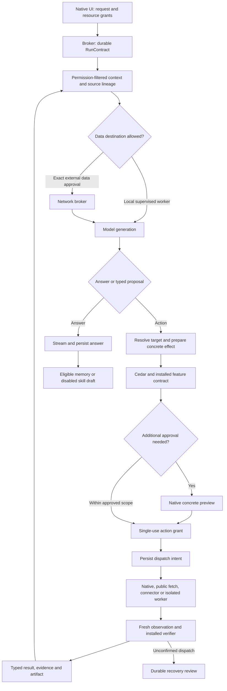

# Sage v2 architecture

Status: implementation and qualification in progress. This is the durable target architecture and the contract for finishing the migration, not a claim that every subsystem is deployed. Read [implementation status](implementation-status.md) and the [threat model](threat-model.md) before distributing a build.

## Product and limits

Sage is a native Mac and Windows personal agent. Retain SwiftUI/AppKit, WinUI and the Rust core. Conversation, files, research, coding, computer control, memory, voice and automation share one authorization pipeline. Processing is local by default; configured external endpoints require permission for the exact data release. A loopback HTTP server is an externally managed destination, not proof of local inference.

The reference device has 16 GB RAM. Admit at most 8 GiB of combined Sage workloads, reduced under memory pressure. Allow one heavy generative job, one host mutation lane, two independent read lanes, 32 tool steps per run and two repair attempts for a failed planning step. A dispatched action with unconfirmed results is never automatically repeated. No idle VM, background reasoning, automatic cloud fallback or continuous screen capture.

The objective is measured verified task success at acceptable latency and energy. Universal superiority and perfect security are not release claims.

## Boundaries and ownership

| Boundary | Owns | Must not possess |
|---|---|---|
| Native UI | Conversation, task controls, concrete previews, scope selection | Grant issuance, installable model-generated policy |
| Rust authority broker | Run scope, Cedar decisions, resource identity, exact grants, journal | Unrestricted executable extension loading |
| Agent runtime | Context requests, incremental proposals, answer streaming | Credentials, direct host mutations, policy installation |
| Model worker | Approved context and admitted model assets | General network, credentials, desktop control |
| Network broker | Destination validation, request limits, credential injection | Ambient proxy credentials, automatic redirect following |
| Native service | Identified application/accessibility operations, OS authentication | Broad shell command interface |
| Tool/VM worker | Explicitly copied workspace and brokered services | Home mount, clipboard, host sockets, credential stores |
| Data service | Encrypted history, memory, recovery artifacts and source lineage | Policy changes derived from recalled text |

Today, the broker, context builder, remote-provider client, retrieval and scheduler remain Rust modules within `sage-core`. They are not yet isolated services. Managed inference starts a separate restricted process. Native platform access remains in the authenticated UI adapter; extraction into signed, narrowly authenticated native services is a production gate. The browser host has its own role credential and cannot authenticate as the native UI.

## Execution contracts

Authority-bearing client messages use `proto/sage/ipc/v2/sage.proto`; version mismatch refuses execution. The generated Swift and build-generated C# bindings ship with the corresponding core. Historical v1 source is preserved during migration and excluded from the Mac build.

`contracts.rs` defines `RunContract`, resource/effect scopes, provenance-bearing `ContextItem`, sensitivity labels, `ToolResult`, verification and approval records. `domain/action.rs` retains the closed typed action language. `features.rs` is the shared discovery and schema contract; `compiler.rs` refuses operations without an enabled contract. `capability.rs` binds grants to run, action, complete action digest, policy version, target resource, expiry, worker session and a single use.

A complete prepared action is the broker-resolved proposal with installed verification, concrete preview and broker-generated preconditions. File preparation records the opened target identity. Browser preparation records tab, window, top-level frame, document ID, navigation generation, URL and origin. These values enter the approval digest. Models cannot choose their own verifier or replace these preconditions.

Dynamic content is data. Model JSON is independently decoded and validated against the closed built-in schema set; constrained generation is only an aid. Adapter execution authority travels in typed protobuf fields. Browser target fields are typed on the authority IPC. Adapter observations still contain bounded structured values with operation-specific validation; replacing the remaining generic envelopes is tracked explicitly.

## Conversation and context

The runtime accepts answer-only turns and incremental action turns. It returns actual verified tool outputs to the next turn. It does not infer success from an action count. SSE parsing is bounded, handles fragmented UTF-8, emits only answer prefixes and requires normal stream completion before accepting a proposal. No partial JSON executes a tool.

A task does not capture the previously focused application. Relevant history, enabled scoped memories, bounded tool results and explicit observations are untrusted context. Recalled instructions cannot authorize effects. File results are bounded; common credential patterns are redacted before entering model context. Derived results retain private classification. Exact external-release approval displays the destination and serialized context selected for transmission. Provider settings alone are not permission to send history or files.

Source-to-task and memory-to-derived-memory relations are retained. Forgetting removes derived memories, excludes source/affected history from future context, clears affected summaries/working context and removes related retained artifacts. Inspectable source conversation history is retained separately; deletion of a memory is not presented as physical erasure of every historical record or backup. Active runs are cancelled when memory access is revoked so an already selected context cannot continue granting work.

## Files, browser and research

File tools begin with no Desktop/Documents/Downloads roots. Native UI submissions can grant reading or non-overwriting creation within a selected folder. Overwrite, external effects and expanded resources require exact approval. Sage's database, policy, credentials, models and installed core paths are excluded. Read/write operations use directory handles, reject final symlinks, special files and multiply linked files, validate identities and enforce byte limits. Creation is exclusive; replacement stages and flushes content, then uses same-directory atomic rename without deleting the destination first. New recovery copies are encrypted database artifacts.

Undo validates expected current content or directory identity and shares the mutation lane. Its dispatch is journaled and consumed before mutation. Legacy recovery operations require manual review. A crash during Undo cannot promise successful restoration. Concurrent third-party writes between final version check and replacement remain a documented platform limitation requiring stronger platform controls before production qualification.

Browser pairing is user-triggered `activeTab` access. Navigation is limited to the paired origin and prepared top-level document. Origin, tab, window or document changes invalidate preparation. The extension checks the target immediately before dispatch and returns the resulting document for fresh verification. Generic clicks, typing, submission and uploads are unavailable until their complete effect/verification contracts pass qualification. DOM content never grants authority.

`fetch_public` uses a separate cookie-free HTTPS request path: public addresses only, port 443, pinned DNS, no proxies, no credentials, no redirects, bounded bodies and supported UTF-8 text/HTML/JSON types. HTML is returned as untrusted source text without executing or rendering it. PDF/Office and other rich document parsing await isolated parsers. Search-provider connectors are separately scoped integrations; they are not authenticated browser sessions.

## Inference and resource management

The baseline candidate is Qwen3.5-4B converted from the official checkpoint into a reproducible GGUF Q4_K_M profile for llama.cpp, with 8K context and one reasoning generation. A 9B model is an optional larger-device tier. Gemma 4 E2B/E4B is an evaluation alternative. Qwen3-Embedding-0.6B at 512 dimensions is the retrieval candidate. Whisper.cpp multilingual base and an independently qualified local keyword/VAD worker are the speech targets. Offline OS voices are the initial TTS option. None of these candidate names means an admitted production asset is bundled.

`inference.rs` admits signed Ed25519 model profiles with runtime/model/dependency digests, revision, expiry, license, quantization, bounded context/output, memory envelope and evaluation reference. The current supervised CPU prototype is macOS-only and starts on demand with cleared environment, bounded output, timeout, cancellation and a restrictive sandbox. Unsupported backends fail closed. Its metadata admission is not a kernel-enforced RSS limit or a VM, and it has not been qualified with a real model. A production worker needs immutable asset handles, measured memory enforcement, tokenizer-based budgets, warm residency, thermal/battery feedback and platform isolation acceptance.

Total memory includes weights, metadata, KV/recurrent state, activations, buffers, speech/vision and VM reservations. The shared governor prevents a second heavy reservation and rejects over-budget jobs without cloud fallback. Queueing and active memory-pressure reclamation remain subsequent scheduler work.

Qualification pipeline: trusted checkpoint → pinned conversion → calibration → quantization → functional/adversarial evaluation → device profiling → signed catalog admission. Compare Q4 against FP16/BF16 and Q5/Q8 on planning, tool arguments, grounding, retrieval and safety. KV quantization, AWQ/GPTQ, speculative decoding and backend-specific kernels require compatible runtime evidence. Never speculate side effects. Two-bit weights, pruning and aggressive state compression belong to research.

SQLite/SQLCipher and FTS5 are implemented. Vector retrieval, the pinned static vector extension, embedding worker, tokenizer-based allocation and model-versioned caches remain explicitly unqualified. No synthetic vectors or made-up retrieval benchmarks replace them.

## Reusable features and schedules

Only a completely verified trace can become a skill draft. Review binds to its exact digest; editing invalidates that review. Instantiation assigns new IDs, clears prior preparation metadata and marks the trace untrusted. Running a reviewed skill still traverses current policy, resources, approvals and verification. Workflows compose at most 32 steps. Parameter schemas, bindings and automatic promotion are not implicitly inferred from a successful trace.

Schedules persist their explicit resource scopes, expiry, remaining runs, trigger, overlap state and dispatch claim. Native defaults are 30 days/100 runs, shown before saving. Folder watches require a typed read grant for that folder. Background application observation is unavailable. Overlap is prevented by conversation/run state. Interrupted or approval-waiting work is retained; a crash after claiming a firing disables that schedule for review. Encrypted schedules wait for protected storage to be unlocked after restart.

Every new feature must define outcome/platforms, typed schemas, resource/effect/destination bounds, isolation, independent success evidence, partial-completion/recovery behavior, cancellation and replay handling. Add adversarial conformance tests, measured cost/success, a signed release manifest, readiness checks and a reversible rollout flag. A connected adapter is never enough to enable an arbitrary operation. WASM imports, MCP servers and VM output remain untrusted and cannot mint grants.

## Isolation and future adapters

Arbitrary code must run in a Linux VM: Apple Virtualization on Mac, a signed pinned QEMU/WHPX distribution on Windows. No shared home, clipboard, host sockets or credentials. Copy input into a disposable workspace and export validated artifacts/patches. No general network interface; approved requests use the network broker. Guest namespaces, seccomp and filesystem isolation must be checked, with failure disabling execution. A sandbox-exec host-command fallback is not a substitute for this VM.

Native accessibility controls the real host and therefore requires stricter effect analysis than guest code. Privileged functions need individually signed handlers and service-verified native authentication; a UI Boolean is not a production proof. Model workers, document parsers and extensions must be extracted from broker authority. MCP supplies protocol interoperability, not trust. Edge workers need mutual authentication plus the same data-release controls. None is enabled merely by finding an executable or an endpoint.

## Research track

Keep experiments separate from installed policy and production catalog promotion:

- Compile reviewed, proven traces into parameterized state machines; require at least 30% lower repeated-workflow median latency with unchanged permissions and verifiers.
- Context deltas carry changed state plus source identities; require 25% fewer input tokens without material verified-success loss.
- Routing uses measured task family, load, privacy permissions and calibrated failure signals. It cannot silently add a cloud route.
- Mixed precision needs meaningful memory/latency gains with at most one percentage-point task-success regression.
- Distillation/QAT uses licensed synthetic data and explicitly consented traces; private history is never training data by default.

Promotion requires independent qualification, not the experiment approving itself.

## Reference decisions

Hermes informs iterative conversation, searchable history and progressive skill loading; OpenClaw informs typed gateway/device/task boundaries. NemoClaw/OpenShell informs independent sandbox, credential, network and inference controls. Their defaults and operator trust assumptions are not copied as Sage guarantees.

Primary references:

- [Hermes architecture](https://hermes-agent.nousresearch.com/docs/developer-guide/architecture/) and [skills](https://hermes-agent.nousresearch.com/docs/user-guide/features/skills/)
- [OpenClaw architecture](https://docs.openclaw.ai/concepts/architecture) and [security](https://docs.openclaw.ai/gateway/security)
- [NemoClaw architecture](https://docs.nvidia.com/nemoclaw/latest/user-guide/openclaw/reference/architecture) and [OpenShell controls](https://docs.nvidia.com/openshell/security/best-practices)
- [llama.cpp](https://github.com/ggml-org/llama.cpp), [completion interface](https://github.com/ggml-org/llama.cpp/blob/master/tools/completion/README.md), [grammars](https://github.com/ggml-org/llama.cpp/blob/master/grammars/README.md)
- [Qwen3.5-4B](https://huggingface.co/Qwen/Qwen3.5-4B), [9B](https://huggingface.co/Qwen/Qwen3.5-9B), [Gemma 4](https://ai.google.dev/gemma/docs/core/model_card_4), [Qwen embeddings](https://huggingface.co/Qwen/Qwen3-Embedding-0.6B), [Nemotron 30B/A3B](https://huggingface.co/nvidia/NVIDIA-Nemotron-3-Nano-30B-A3B-BF16)
- [AWQ](https://proceedings.mlsys.org/paper_files/paper/2024/file/42a452cbafa9dd64e9ba4aa95cc1ef21-Paper-Conference.pdf), [GPTQ](https://arxiv.org/abs/2210.17323), [KIVI](https://arxiv.org/abs/2402.02750), [speculative decoding](https://arxiv.org/abs/2211.17192)
- [MLX-LM](https://github.com/ml-explore/mlx-lm), [ONNX providers](https://onnxruntime.ai/docs/execution-providers/), [whisper.cpp](https://github.com/ggml-org/whisper.cpp), [sherpa-onnx](https://github.com/k2-fsa/sherpa-onnx)
- [Cedar](https://docs.rs/cedar-policy/latest/cedar_policy/), [SQLCipher](https://www.zetetic.net/sqlcipher/sqlcipher-api/), [Wasmtime](https://docs.wasmtime.dev/security.html), [MCP](https://modelcontextprotocol.io/docs/draft/tutorials/security/security_best_practices)
- [Apple Virtualization](https://developer.apple.com/documentation/virtualization/creating-and-running-a-linux-virtual-machine), [QEMU WHPX](https://www.qemu.org/docs/master/system/whpx.html), [TUF](https://theupdateframework.io/)
