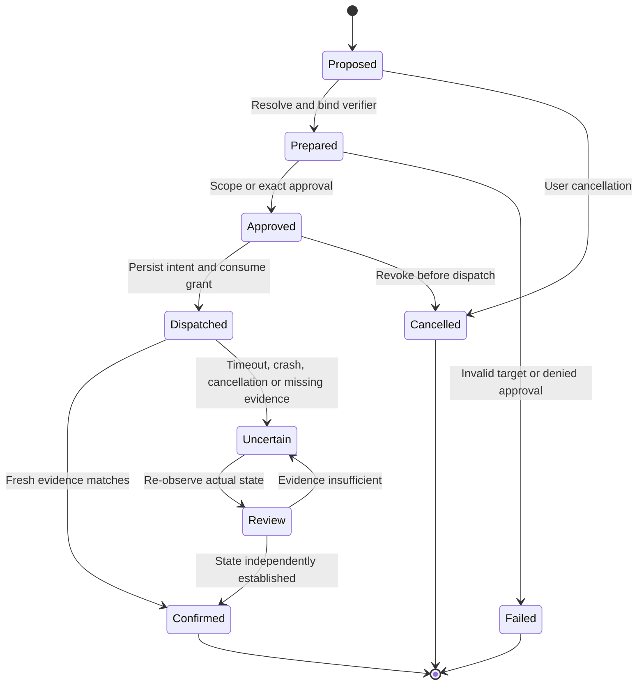

# Sage v2 threat model

This model describes enforced boundaries, residual risks and required production gates. It does not certify security against a compromised operating system or malicious administrator.

## Assets and adversaries

Protect private documents, conversations, source code, memory, credentials, browser sessions, user intent, approvals, execution grants, model/catalog identity, recovery artifacts and update metadata. The main adversarial inputs are model output, webpages, documents, repository text, tool/MCP results, memory, plugin code, model assets and stale or replayed IPC messages. Another process running as the same user is also relevant: owner-only files do not establish signed application identity.

Trusted components are the OS, hypervisor, authority/credential brokers and validated narrow native services. The current core still has a wider trusted base because context construction, provider networking, data access and planning orchestration share a process. Browser/native adapters are trusted enforcement components; website/DOM text is not.

## Threat-to-control matrix

| Threat | Current control/evidence | Remaining production gate |
|---|---|---|
| Model invents permission | No grant-setting tool; closed actions; broker Cedar gate; untrusted provenance | Adversarial real-model evaluation, smaller runtime boundary |
| Prompt injection from memory/history/tool output | Source separation, bounded context, scoped retrieval, independent action authorization | AgentDojo/computer-use red-team runs; no claim of universal detection |
| Unauthorized cloud disclosure | Per-call exact destination/context approval; settings are not consent; loopback remains external | Source-specific release leases and fully typed data-release IPC |
| Browser impersonates UI | Separate derived role credential and server-side role restriction | Signed peer/component verification and protected per-component key provisioning |
| IPC replay | Nonces, mutual HMAC proof, protocol v2, monotonic sequence, duplicate request rejection | OS-specific identity/ACL penetration tests |
| Fragmented-frame corruption | Dedicated frame reader; bounded protobuf transport | Fuzz corpus and sustained connection pressure tests |
| Replayed/changed execution | Single-use grants, task/action/digest/policy/worker session, cancellation revocation | Attenuation model checking and platform revocation timing acceptance |
| Private-network/metadata SSRF | Address classification, DNS pinning, no proxies, no redirects | Device/network test matrix, explicitly scoped edge/private routes |
| Browser target changes after preview | Tab/window/frame/document/navigation identity; immediate pre-dispatch check | Chrome end-to-end race tests; no claim of atomic tabs API compare-and-swap |
| Generic UI click commits unknown effect | Click/type/submit/upload handlers not enabled | Effect classification, value/recipient/submission evidence and signed native service |
| File path replaced with symlink/hardlink | Component-wise no-follow handles, identity validation, hardlink rejection | Windows reparse/ADS/UNC qualification; third-party writer compare-and-replace race |
| File destroyed during replacement | Exclusive staging, flush, same-directory atomic replacement, encrypted backup | Filesystem crash/power-loss matrix and cross-volume export policy |
| Unsafe Undo | Current content/hash or directory identity required; shared mutation lane; journaled consumption | Fault injection around consumption and restoration; user recovery UI for ambiguous Undo |
| Arbitrary code escapes | Arbitrary host command tools disabled | Qualified Mac VM and Windows QEMU/WHPX backend, guest restrictions, artifact transfer |
| Model/runtime tampering | Signed profile, digests, bounded admission, restricted process prototype | Immutable asset handoff, catalog rollback protection, bundled trusted root and platform runtime qualification |
| Plaintext retained data | SQLCipher with no plaintext fallback; memory-only temp storage; encrypted staged rollback | Legacy file-recovery migration, key loss/recovery UX, encrypted export and backup retention |
| Memory forgotten but recalled again | Derived-memory deletion, lineage exclusion, summary/context invalidation, active-run cancellation | Complete cache/vector lineage once those backends exist; secure deletion limits communicated |
| Schedule duplicates after interruption | Transactional firing claims, overlap checks, interrupted claims disabled for review | Crash fault matrix at every firing/dispatch boundary |
| Same-user process steals UI key | Owner-only storage and role separation mitigate exposure, but do not solve it | Signed peer identity; native credentials/authentication in independent service |
| Host locks during native action | OS session handling must be checked by native service | Platform lock-state enforcement and physical-device acceptance |
| Supply-chain compromise | Lockfile, pinned security dependencies, pinned CI action commits, signed-profile verifier | TUF expiry/rollback/root rotation, SBOM/scanning, app/helper/model/VM signing and notarization |

## Authority invariants

1. Only the broker creates a grant. Untrusted content may propose actions but cannot install policy or increase scope.
2. A run grant permits bounded resource/effect classes. Every dispatch still consumes an exact action grant.
3. Approval binds the prepared payload, target identity, destination, preconditions and policy. Material changes require fresh preparation.
4. Only supported operations are advertised. A worker binary or connected adapter does not enable a broad executor class.
5. Credentials are never ordinary model context. Secret scanning supplements source permissions and is not a proof that all secrets were detected.
6. Model-derived output inherits restrictions from its inputs. Summarization, cache reuse and learned skills cannot declassify it.
7. A successful dispatch is not necessarily verified success. HTTP success proves a particular response; process exit proves process completion; neither proves arbitrary semantic correctness.
8. An uncertain external effect is reconciled before another attempt. No exactly-once promise exists without destination support.
9. Revocation prevents new core dispatch; an already dispatched external/native operation may still complete and must be reported as uncertain when its result is lost.
10. Unsupported isolation fails closed. No fallback shell, unrestricted helper or silent external model route is available.

## Recovery state machine

The small state machine should be model-checked for grant consumption, revocation and recovery. Deterministic tests already cover role impersonation, replay, scope, cancellation and tool-result execution; they are not a substitute for that exhaustive proof.

## Explicit limits

SQLCipher protects the stored database and WAL pages under its key. It cannot revoke plaintext previously shown to a user, sent to an explicitly approved service, retained in OS backups, or read before migration. The migration's encrypted rollback contains historical data and must be subject to a user-visible retention/deletion policy. Deleting a memory retains inspectable original conversation history but excludes the identified material from future model context.

Audit hashes make a chain tamper-evident when checked against a separately protected checkpoint. The current chain alone does not protect against truncation or replacement by an attacker holding the database key. Protected checkpoints and their verification are release gates. Never call this audit log immutable against a compromised host.

A development binary with file-based UI credentials, a same-process native adapter, or a catalog root supplied on a command line does not meet the target production identity model. Production distribution remains blocked until those boundaries, signed updates and platform acceptance are completed.
